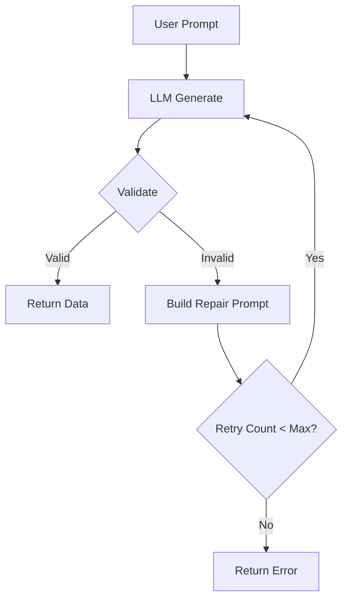

# Core Concepts

This guide provides a comprehensive understanding of Ex Outlines' architecture, design principles, and core mechanisms. After reading this, you'll understand how Ex Outlines guarantees valid LLM outputs and how to leverage its features effectively.

## Table of Contents

- [What is Structured Generation?](#what-is-structured-generation)
- [Schema Definition](#schema-definition)
- [Type System](#type-system)
- [Validation Process](#validation-process)
- [Diagnostics](#diagnostics)
- [The Retry-Repair Loop](#the-retry-repair-loop)
- [Backends](#backends)
- [Batch Processing](#batch-processing)
- [Telemetry & Observability](#telemetry--observability)
- [Comparison to Python Outlines](#comparison-to-python-outlines)

---

## What is Structured Generation?

### The Problem

Large Language Models (LLMs) are powerful but unpredictable. When you ask an LLM to generate JSON, you might get:

- Valid JSON: `{"name": "Alice", "age": 30}`
- Invalid JSON: `{name: Alice, "age": "thirty"}`
- Markdown wrapper: ` ```json\n{"name": "Alice"}\n``` `
- Extra text: `Sure! Here's the data: {"name": "Alice"}`
- Wrong types: `{"name": 123, "age": "30"}`
- Missing fields: `{"name": "Alice"}`

Traditional approaches:
1. **Prompt Engineering**: "Return valid JSON with no extra text..."
   - Still unreliable
   - Wastes tokens on instructions
   - Model-specific

2. **Parse and Hope**: Try to extract JSON, handle errors
   - Fragile (many edge cases)
   - Silent failures (missing fields)
   - Complex error handling

### The Ex Outlines Solution

**Structured Generation with Validation and Repair:**

1. **Define a Schema**: Specify exactly what you expect
   ```elixir
   schema = Schema.new(%{
     name: %{type: :string, required: true},
     age: %{type: :integer, min: 0, max: 120}
   })
   ```

2. **Generate**: Call LLM with structured output request
   ```elixir
   ExOutlines.generate(schema, backend: HTTP, backend_opts: opts)
   ```

3. **Validate**: Check output against schema
   - If valid, return data
   - If invalid, explain errors to LLM and retry

4. **Guarantee**: Repeat until valid or max retries exhausted

**Result**: Either `{:ok, validated_data}` or `{:error, reason}` with no surprises.

### Structured Generation vs. Prompt Engineering

| Approach | Reliability | Complexity | Token Cost | Model Agnostic |
|----------|-------------|------------|------------|----------------|
| **Prompt Engineering** | 70-90% | High (many edge cases) | High (instructions) | No (model-specific) |
| **Ex Outlines** | 95-99% | Low (declarative schema) | Medium (repair attempts) | Yes |

---

## Schema Definition

A **schema** is a declarative specification of your expected data structure. It serves as a contract between your application and the LLM.

### Basic Schema Structure

```elixir
schema = Schema.new(%{
  field_name: %{
    type: field_type,
    required: boolean,
    # ... constraints
  }
})
```

### Field Specifications

Every field specification is a map with:

```elixir
%{
  type: :string | :integer | :boolean | :number | complex_type,
  required: true | false,
  description: "Optional field description for LLM context",
  # Type-specific constraints...
}
```

### Common Constraints

**String constraints:**
```elixir
%{
  type: :string,
  min_length: 3,
  max_length: 100,
  pattern: ~r/^[A-Za-z\s]+$/  # Regex pattern
}
```

**Integer/Number constraints:**
```elixir
%{
  type: :integer,
  min: 0,
  max: 100,
  positive: true  # Shorthand for min: 1
}
```

**Array constraints:**
```elixir
%{
  type: {:array, %{type: :string}},
  min_items: 1,
  max_items: 10,
  unique_items: true
}
```

### Complete Example

```elixir
user_schema = Schema.new(%{
  # Required string with length constraint
  username: %{
    type: :string,
    required: true,
    min_length: 3,
    max_length: 20,
    pattern: ~r/^[a-zA-Z0-9_]+$/,
    description: "Alphanumeric username"
  },

  # Required email with pattern
  email: %{
    type: :string,
    required: true,
    pattern: ~r/@/,
    description: "Valid email address"
  },

  # Integer with range
  age: %{
    type: :integer,
    required: true,
    min: 13,
    max: 120,
    description: "User age (must be 13+)"
  },

  # Enum (multiple choice)
  role: %{
    type: {:enum, ["user", "admin", "moderator"]},
    required: true,
    description: "User role in system"
  },

  # Optional field (nullable)
  bio: %{
    type: {:union, [
      %{type: :string, max_length: 500},
      %{type: :null}
    ]},
    required: false,
    description: "Optional user biography"
  },

  # Array of strings
  interests: %{
    type: {:array, %{type: :string, max_length: 50}},
    required: false,
    min_items: 0,
    max_items: 10,
    unique_items: true,
    description: "List of user interests"
  }
})
```

---

## Type System

Ex Outlines has a rich type system supporting both primitive and composite types.

### Primitive Types

#### `:string`
Text values.

```elixir
%{type: :string}
```

**Constraints**: `min_length`, `max_length`, `pattern`

**Valid**: `"hello"`, `""`
**Invalid**: `123`, `true`, `nil`

#### `:integer`
Whole numbers.

```elixir
%{type: :integer, min: 0, max: 100}
```

**Constraints**: `min`, `max`, `positive`

**Valid**: `0`, `42`, `-10`
**Invalid**: `3.14`, `"42"`, `nil`

#### `:boolean`
True or false values.

```elixir
%{type: :boolean}
```

**Valid**: `true`, `false`
**Invalid**: `"true"`, `1`, `0`, `nil`

#### `:number`
Integer or float.

```elixir
%{type: :number, min: 0, max: 100}
```

**Constraints**: `min`, `max`

**Valid**: `42`, `3.14`, `-2.5`
**Invalid**: `"42"`, `true`, `nil`

### Composite Types

#### `{:enum, values}`
One of a fixed set of values.

```elixir
%{type: {:enum, ["red", "green", "blue"]}}
```

**Valid**: `"red"`, `"green"`, `"blue"`
**Invalid**: `"yellow"`, `"RED"`, `123`

Enums are case-sensitive and type-sensitive.

#### `{:array, item_spec}`
List of items, each conforming to `item_spec`.

```elixir
# Array of strings
%{type: {:array, %{type: :string}}}

# Array of integers with constraints
%{type: {:array, %{type: :integer, min: 0, max: 100}}}

# Array of objects
%{type: {:array, %{type: {:object, nested_schema}}}}
```

**Constraints**: `min_items`, `max_items`, `unique_items`

**Valid**: `["a", "b", "c"]`, `[]`, `[1, 2, 3]`
**Invalid**: `"not an array"`, `[1, "mixed", true]` (if item_spec requires integers)

#### `{:object, schema}`
Nested object with its own schema.

```elixir
address_schema = Schema.new(%{
  street: %{type: :string, required: true},
  city: %{type: :string, required: true},
  zip: %{type: :string, pattern: ~r/^\d{5}$/}
})

person_schema = Schema.new(%{
  name: %{type: :string, required: true},
  address: %{type: {:object, address_schema}, required: true}
})
```

**Validation**: Recursively validates nested object.
**Error paths**: Include full path (e.g., `"address.city"`)

#### `{:union, type_specs}`
Value can match **any one** of the provided type specifications.

```elixir
# String or null (optional field)
%{type: {:union, [
  %{type: :string},
  %{type: :null}
]}}

# String or integer ID
%{type: {:union, [
  %{type: :string, pattern: ~r/^[A-Z]{3}\d{6}$/},
  %{type: :integer, positive: true}
]}}
```

**Validation**: Tries each type spec in order, succeeds on first match.

### Type Comparison to Elixir

| Ex Outlines Type | Elixir Type | Notes |
|-----------------|-------------|-------|
| `:string` | `String.t()` | Binary string |
| `:integer` | `integer()` | Whole number |
| `:boolean` | `boolean()` | `true` or `false` |
| `:number` | `number()` | Integer or float |
| `{:enum, [...]}`| N/A | Runtime constraint |
| `{:array, spec}` | `list(T)` | Homogeneous list |
| `{:object, schema}` | `map()` | Map with atom keys |
| `{:union, specs}` | N/A | Runtime union type |

---

## Validation Process

Validation transforms and validates JSON data against a schema.

### Step-by-Step Process

```
Input (JSON string or map with string keys)
  ↓
1. Parse (if string) → Jason.decode
  ↓
2. Validate each field against spec
  ↓
3. Collect all errors (not fail-fast)
  ↓
4. Transform keys (string → atom)
  ↓
Output: {:ok, validated_map} or {:error, diagnostics}
```

### Example Walkthrough

```elixir
schema = Schema.new(%{
  name: %{type: :string, min_length: 2},
  age: %{type: :integer, min: 0, max: 120}
})

# Input (string keys)
input = %{"name" => "Alice", "age" => 30}

# Validation steps:
# 1. Check "name": string? ✓ Length >= 2? ✓
# 2. Check "age": integer? ✓ >= 0? ✓ <= 120? ✓
# 3. No errors, transform keys
# 4. Return {:ok, %{name: "Alice", age: 30}}
```

### Validation Order

1. **Required field check**: Are all required fields present?
2. **Type check**: Is the value the correct type?
3. **Constraint check**: Does the value satisfy constraints?

### Error Collection

**Ex Outlines validates all fields** before returning errors (not fail-fast):

```elixir
input = %{
  "name" => "X",      # Too short
  "age" => 150        # Too high
}

{:error, diagnostics} = Spec.validate(schema, input)

# diagnostics.errors contains BOTH errors:
# [
#   %{field: "name", message: "must be at least 2 characters", ...},
#   %{field: "age", message: "must be at most 120", ...}
# ]
```

This provides complete feedback in a single validation pass.

### Nested Validation

For nested objects, validation is **recursive**:

```elixir
person_schema = Schema.new(%{
  name: %{type: :string},
  address: %{type: {:object, address_schema}}
})

# Validates person fields, then recursively validates address fields
# Error paths include nesting: "address.city"
```

---

## Diagnostics

The `Diagnostics` struct contains detailed validation results.

### Structure

```elixir
%ExOutlines.Diagnostics{
  valid?: boolean(),
  errors: [error_map()]
}
```

### Error Map Structure

Each error is a map with:

```elixir
%{
  field: String.t(),      # Field path (e.g., "address.city")
  expected: String.t(),   # What was expected
  got: any(),             # What was received
  message: String.t()     # Human-readable message
}
```

### Example

```elixir
schema = Schema.new(%{
  email: %{type: :string, pattern: ~r/@/},
  age: %{type: :integer, min: 18}
})

input = %{"email" => "invalid", "age" => 15}

{:error, diagnostics} = Spec.validate(schema, input)

IO.inspect(diagnostics, pretty: true)
# %ExOutlines.Diagnostics{
#   valid?: false,
#   errors: [
#     %{
#       field: "email",
#       expected: "string matching pattern ~r/@/",
#       got: "invalid",
#       message: "Field 'email' must match pattern ~r/@/"
#     },
#     %{
#       field: "age",
#       expected: "integer >= 18",
#       got: 15,
#       message: "Field 'age' must be at least 18"
#     }
#   ]
# }
```

### Using Diagnostics

**Check validity:**
```elixir
if diagnostics.valid? do
  # ...
end
```

**Format for display:**
```elixir
diagnostics.errors
|> Enum.map(& &1.message)
|> Enum.join("\n")
# "Field 'email' must match pattern ~r/@/\nField 'age' must be at least 18"
```

**Send to LLM for repair:**
```elixir
# Ex Outlines does this automatically
error_summary = Enum.map(diagnostics.errors, fn err ->
  "- #{err.message}"
end) |> Enum.join("\n")

repair_prompt = """
The previous output was invalid:
#{error_summary}

Please fix these issues and return valid JSON.
"""
```

---

## The Retry-Repair Loop

The retry-repair loop is Ex Outlines' core mechanism for guaranteeing valid outputs.

### How It Works



### Detailed Flow

**Attempt 1: Initial Generation**
```
→ Prompt: "Extract user data from: 'John is 25 years old'"
→ Schema: {name: string, age: integer (0-120)}
→ LLM Response: {"name": "John", "age": "25"}  # age is string, not integer
→ Validation: FAIL - age must be integer
```

**Attempt 2: Repair**
```
→ Repair Prompt:
   "The previous output was invalid:
    - Field 'age' has incorrect type. Expected integer, got string \"25\"
    Please fix and return valid JSON."
→ LLM Response: {"name": "John", "age": 25}  # Fixed!
→ Validation: SUCCESS
→ Return: {:ok, %{name: "John", age: 25}}
```

### Repair Prompt Construction

Ex Outlines automatically builds repair prompts that include:

1. **Context**: Original prompt and schema
2. **Error Feedback**: Clear, specific error messages
3. **Instructions**: "Fix the output and return valid JSON"

Example repair prompt:

```
You previously generated:
{"name": "Alice", "age": 150}

This output was invalid for the following reasons:
- Field 'age' must be at most 120

Please correct these errors and generate valid JSON that matches the schema.
```

### Configuration

```elixir
ExOutlines.generate(schema,
  backend: HTTP,
  backend_opts: opts,
  max_retries: 3  # Default: 3
)
```

**Retry count includes initial attempt:**
- `max_retries: 1` → 1 attempt total (no retries)
- `max_retries: 3` → 3 attempts total (2 retries after initial)
- `max_retries: 5` → 5 attempts total (4 retries after initial)

### When to Adjust max_retries

**Increase `max_retries` (4-5) when:**
- Complex schemas with many constraints
- Ambiguous prompts requiring clarification
- Lower-capability models (e.g., smaller/cheaper models)

**Decrease `max_retries` (1-2) when:**
- Simple schemas (few fields, basic types)
- High-quality prompts with clear examples
- Capability models (e.g., GPT-4, Claude Opus)
- Cost-sensitive applications

### Cost Considerations

Each retry = another LLM API call:
- More retries = higher API costs
- Balance reliability vs. cost for your use case
- Monitor retry rates with telemetry (see below)

---

## Backends

Backends handle communication with LLM APIs. Ex Outlines supports multiple backends through a common interface.

### Backend Behavior

All backends implement the `ExOutlines.Backend` behavior:

```elixir
@callback call_llm(messages :: [message()], opts :: keyword()) ::
  {:ok, String.t()} | {:error, term()}
```

Where `message()` is:

```elixir
%{
  role: "system" | "user" | "assistant",
  content: String.t()
}
```

### Available Backends

#### HTTP Backend (OpenAI-Compatible)

Works with OpenAI, Azure OpenAI, and compatible APIs:

```elixir
alias ExOutlines.Backend.HTTP

backend_opts = [
  api_key: "sk-...",
  model: "gpt-4o-mini",
  api_url: "https://api.openai.com/v1/chat/completions",
  temperature: 0.0,  # Optional, default: 0.0
  max_tokens: 1024   # Optional
]

ExOutlines.generate(schema, backend: HTTP, backend_opts: backend_opts)
```

**Supported APIs:**
- OpenAI (GPT-3.5, GPT-4, GPT-4o)
- Azure OpenAI
- Any OpenAI-compatible endpoint

#### Anthropic Backend

Native Claude API support:

```elixir
alias ExOutlines.Backend.Anthropic

backend_opts = [
  api_key: "sk-ant-...",
  model: "claude-3-5-sonnet-20241022",
  max_tokens: 1024,  # Required by Anthropic
  temperature: 0.0   # Optional
]

ExOutlines.generate(schema, backend: Anthropic, backend_opts: backend_opts)
```

**Supported Models:**
- Claude 3.5 Sonnet
- Claude 3 Opus
- Claude 3 Sonnet
- Claude 3 Haiku

#### Mock Backend (Testing)

Deterministic responses for testing:

```elixir
alias ExOutlines.Backend.Mock

# Single response
mock = Mock.new([{:ok, ~s({"name": "Alice", "age": 30})}])

# Multiple responses (for retry testing)
mock = Mock.new([
  {:ok, ~s({"name": "Alice", "age": "invalid"})},  # First attempt (invalid)
  {:ok, ~s({"name": "Alice", "age": 30})}          # Second attempt (valid)
])

# Always return same response
mock = Mock.always({:ok, ~s({"name": "Bob", "age": 25})})

# Always fail
mock = Mock.always_fail(:rate_limited)

ExOutlines.generate(schema, backend: Mock, backend_opts: [mock: mock])
```

### Backend Comparison

| Backend | Use Case | Pros | Cons |
|---------|----------|------|------|
| **HTTP** | OpenAI, Azure | Fast, well-tested | Requires API key |
| **Anthropic** | Claude models | Native API, long context | Requires API key |
| **Mock** | Testing | Deterministic, free | Not real LLM |

### Custom Backends

Implement the `ExOutlines.Backend` behavior:

```elixir
defmodule MyBackend do
  @behaviour ExOutlines.Backend

  @impl true
  def call_llm(messages, opts) do
    # Your implementation
    # Return {:ok, response_text} or {:error, reason}
  end
end
```

---

## Batch Processing

Process multiple schemas concurrently using BEAM's lightweight processes.

### Basic Batch Processing

```elixir
tasks = [
  {schema1, [backend: HTTP, backend_opts: opts1]},
  {schema2, [backend: HTTP, backend_opts: opts2]},
  {schema3, [backend: HTTP, backend_opts: opts3]}
]

results = ExOutlines.generate_batch(tasks)
# [
#   {:ok, result1},
#   {:ok, result2},
#   {:error, reason3}
# ]
```

### Batch Options

```elixir
ExOutlines.generate_batch(tasks,
  max_concurrency: 5,     # Default: System.schedulers_online()
  timeout: 60_000,        # Per-task timeout (ms), default: 60_000
  ordered: true,          # Preserve input order, default: true
  on_timeout: :kill_task  # Default: :kill_task
)
```

**Options:**
- `max_concurrency`: Maximum concurrent LLM calls
- `timeout`: Milliseconds before task times out
- `ordered`: If `true`, results match input order. If `false`, results arrive as completed (faster).
- `on_timeout`: What to do when task times out (`:kill_task` only option currently)

### BEAM Concurrency Advantage

Ex Outlines uses `Task.async_stream` for batch processing:

**Benefits:**
- **Lightweight processes**: BEAM can handle thousands of concurrent tasks
- **Fault isolation**: One failure doesn't crash others
- **Efficient scheduling**: BEAM scheduler optimizes CPU usage
- **Backpressure**: `max_concurrency` prevents overwhelming APIs

**Comparison to sequential:**

```elixir
# Sequential: 10 tasks × 2 seconds each = 20 seconds
results = Enum.map(tasks, fn task ->
  ExOutlines.generate(task)
end)

# Concurrent: 10 tasks in parallel ≈ 2 seconds
results = ExOutlines.generate_batch(tasks, max_concurrency: 10)
```

### Real-World Example

```elixir
# Classify 100 customer messages concurrently
messages = get_customer_messages(100)

tasks = Enum.map(messages, fn msg ->
  {classification_schema, [
    backend: HTTP,
    backend_opts: build_opts(msg)
  ]}
end)

# Process 10 at a time to respect rate limits
results = ExOutlines.generate_batch(tasks, max_concurrency: 10)

# Handle results
Enum.zip(messages, results)
|> Enum.each(fn {msg, result} ->
  case result do
    {:ok, classification} ->
      save_classification(msg.id, classification)
    {:error, reason} ->
      Logger.error("Failed to classify message #{msg.id}: #{inspect(reason)}")
  end
end)
```

---

## Telemetry & Observability

Ex Outlines emits telemetry events for monitoring and debugging.

### Events

#### `[:ex_outlines, :generate, :start]`
Emitted when generation starts.

**Measurements:**
```elixir
%{system_time: integer()}
```

**Metadata:**
```elixir
%{
  schema: Schema.t(),
  backend: module(),
  max_retries: integer()
}
```

#### `[:ex_outlines, :generate, :stop]`
Emitted when generation completes (success or failure).

**Measurements:**
```elixir
%{
  duration: integer(),        # Nanoseconds
  attempt_count: integer()    # Number of attempts made
}
```

**Metadata:**
```elixir
%{
  schema: Schema.t(),
  backend: module(),
  status: :ok | :error,
  error_reason: term() | nil
}
```

#### `[:ex_outlines, :batch, :start]`
Emitted when batch processing starts.

**Measurements:**
```elixir
%{
  system_time: integer(),
  total_tasks: integer()
}
```

**Metadata:**
```elixir
%{
  max_concurrency: integer()
}
```

#### `[:ex_outlines, :batch, :stop]`
Emitted when batch processing completes.

**Measurements:**
```elixir
%{
  duration: integer(),
  total_tasks: integer(),
  success_count: integer(),
  error_count: integer()
}
```

### Attaching Handlers

```elixir
:telemetry.attach(
  "ex-outlines-handler",
  [:ex_outlines, :generate, :stop],
  fn event, measurements, metadata, _config ->
    duration_ms = System.convert_time_unit(measurements.duration, :native, :millisecond)

    Logger.info("""
    LLM Generation completed:
    - Duration: #{duration_ms}ms
    - Attempts: #{measurements.attempt_count}
    - Status: #{metadata.status}
    - Backend: #{metadata.backend}
    """)
  end,
  nil
)
```

### Phoenix.LiveDashboard Integration

```elixir
# lib/my_app_web/telemetry.ex
def metrics do
  [
    # Generation metrics
    summary("ex_outlines.generate.stop.duration",
      unit: {:native, :millisecond},
      tags: [:backend, :status]
    ),

    counter("ex_outlines.generate.stop.count",
      tags: [:backend, :status]
    ),

    summary("ex_outlines.generate.stop.attempt_count",
      tags: [:backend]
    ),

    # Batch metrics
    summary("ex_outlines.batch.stop.duration",
      unit: {:native, :millisecond}
    ),

    distribution("ex_outlines.batch.stop.success_count"),
    distribution("ex_outlines.batch.stop.error_count")
  ]
end
```

### Monitoring Recommendations

**Track these metrics:**
1. **Average attempt count**: High retry rates indicate prompt or schema issues
2. **Error rate**: Percentage of `max_retries_exceeded` errors
3. **Duration**: LLM response times (p50, p95, p99)
4. **Cost**: Estimate API costs (requests × price)

---

## Comparison to Python Outlines

Ex Outlines and Python Outlines share the same goal (structured LLM outputs) but use different approaches:

### Technical Approach

| Aspect | Python Outlines | Ex Outlines |
|--------|----------------|-------------|
| **Constraint Method** | Token-level (logit biasing) | Post-generation validation |
| **FSM Compilation** | Yes (upfront) | No |
| **Retry Strategy** | Constrained sampling | Repair loop with feedback |
| **Performance** | Fewer LLM calls | More LLM calls on failures |
| **Complexity** | Higher (FSM logic) | Lower (validation logic) |
| **Backend Agnostic** | No (needs logit access) | Yes (any API) |

### Feature Parity

| Feature | Python Outlines | Ex Outlines |
|---------|----------------|-------------|
| Basic Types | Yes | Yes |
| JSON Schema | Yes | Yes |
| Nested Objects | Yes | Yes |
| Arrays | Yes | Yes |
| Union Types | Yes | Yes |
| Regex Patterns | Yes | Yes |
| Context-Free Grammars | Yes | No (planned) |
| Batch Processing | Yes | Yes |
| Streaming | Yes | No (planned) |
| Template System | Yes (Jinja2) | No (planned: EEx) |

### Elixir-Specific Advantages

**Ex Outlines has unique advantages:**

1. **BEAM Concurrency**: Lightweight processes for efficient batch processing
2. **Ecto Integration**: Convert Ecto schemas automatically
3. **OTP Patterns**: GenServer-based patterns (future)
4. **Phoenix Integration**: Native LiveView, PubSub support
5. **Fault Tolerance**: Let-it-crash philosophy
6. **Type Safety**: Dialyzer compile-time checks

### When to Choose Ex Outlines

**Choose Ex Outlines if:**
- You're building in Elixir/Phoenix
- You need backend flexibility (any LLM API)
- You want simpler implementation (no FSM complexity)
- You value Ecto/Phoenix integration
- You need BEAM concurrency

**Consider Python Outlines if:**
- You're in Python ecosystem
- You need context-free grammars
- You want absolute minimum LLM calls
- You have logit-level API access

---

## Summary

You now understand Ex Outlines' core concepts:

1. **Structured Generation**: Validation + repair for guaranteed valid outputs
2. **Schemas**: Declarative specifications with rich type system
3. **Validation**: Comprehensive error collection with clear diagnostics
4. **Retry-Repair Loop**: Automatic feedback to LLM for fixing errors
5. **Backends**: Flexible LLM API support (HTTP, Anthropic, Mock)
6. **Batch Processing**: BEAM-powered concurrent generation
7. **Telemetry**: Observable for monitoring and debugging

**Next Steps:**
- [Architecture Guide](architecture.md) - Deep dive into implementation
- [Phoenix Integration](phoenix_integration.md) - Use in web applications
- [Testing Strategies](testing_strategies.md) - Test your integrations
